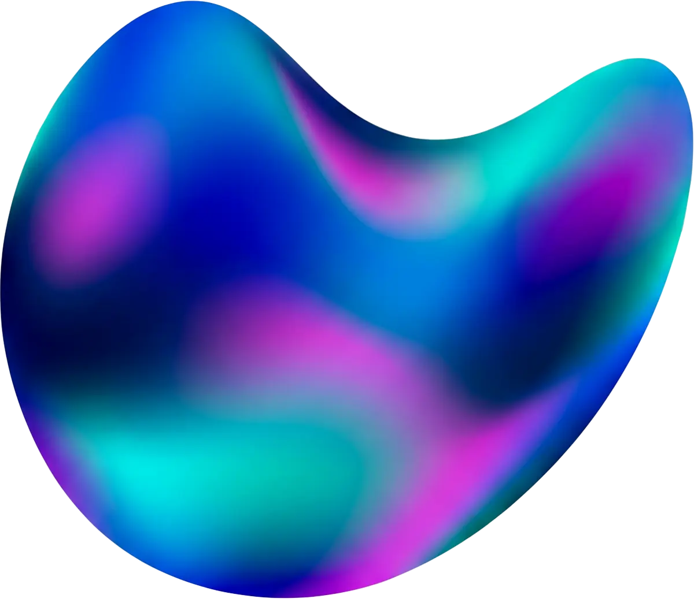

<p align="center">
  <picture>
    <source srcset="docs/media/logo.webp" type="image/webp">
    
  </picture>
</p>

[](https://search.maven.org/search?q=g:dev.chrisbanes.haze) 

# Haze

Visual effects (blur and more) for Compose Multiplatform.

<video width="600" autoplay loop muted playsinline>
  <source src="docs/media/desktop-small.mp4" type="video/mp4">
</video>

Haze provides hardware-accelerated visual effects for Compose Multiplatform — Android, iOS, Desktop, and Web. Built on a modular effect system, it lets you add blur, tint, and custom effects to any composable with a single modifier.

## Platforms

| Platform | Support |
|---|---|
| Android | ✅ |
| Desktop (JVM) | ✅ |
| iOS | ✅ |
| Wasm / JS | ✅ |

## Download

```kotlin
dependencies {
    implementation("dev.chrisbanes.haze:haze:<version>")
    implementation("dev.chrisbanes.haze:haze-blur:<version>")
    implementation("dev.chrisbanes.haze:haze-materials:<version>")
}
```

## Quick start

```kotlin
Modifier.hazeEffect(state = hazeState) {
    blurEffect {
        blurRadius = 20.dp
        colorEffects = listOf(HazeColorEffect.tint(Color.Black.copy(alpha = 0.5f)))
    }
}
```

## License

```
Copyright 2024 Chris Banes

Licensed under the Apache License, Version 2.0 (the "License");
you may not use this file except in compliance with the License.
You may obtain a copy of the License at

    https://www.apache.org/licenses/LICENSE-2.0

Unless required by applicable law or agreed to in writing, software
distributed under the License is distributed on an "AS IS" BASIS,
WITHOUT WARRANTIES OR CONDITIONS OF ANY KIND, either express or implied.
See the License for the specific language governing permissions and
limitations under the License.
```

Full documentation: https://chrisbanes.github.io/haze
