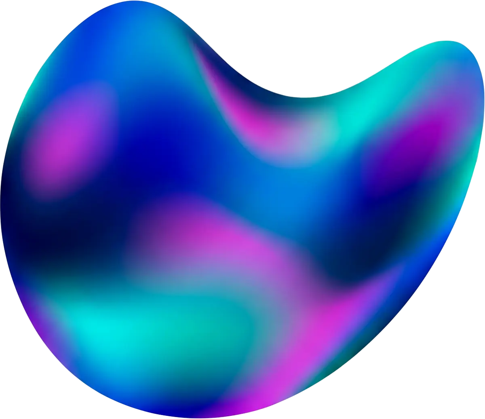

<p align="center">
  
</p>

# Haze

[](https://search.maven.org/search?q=g:dev.chrisbanes.haze) 

Composable visual effects for Compose Multiplatform.

https://github.com/user-attachments/assets/836dd79a-abdc-4cdc-b27d-baee394c1e26

Haze provides hardware-accelerated visual effects for Compose Multiplatform — Android, iOS, macOS, Desktop, and Web. Its modular Haze 2 API lets you apply source-backed or own-content Blur, refraction-driven Glass, and custom effects with explicit, reusable configuration.

Haze 2.0 is currently in beta. If you are upgrading from Haze 1.x or an earlier Haze 2 prerelease, see the [Haze 2 migration guide](https://chrisbanes.github.io/haze/migrating-2.0/).

## Platforms

| Platform | Support |
|---|---|
| Android | ✅ |
| Desktop (JVM) | ✅ |
| iOS | ✅ |
| macOS | ✅ |
| Wasm / JS | ✅ |

## Modules

Add the core module and only the effect modules you use. Keep every Haze artifact on the same version.

| Artifact | Purpose |
|---|---|
| `haze` | Source capture and the typed custom-effect API. |
| `haze-blur` | Blur for captured sources or a modifier's own content. |
| `haze-blur-materials` | Optional ready-made Blur Styles, including `HazeMaterials.thin()`. |
| `haze-blur-material3` | Optional Compose Material 3 Blur Style factory. |
| `haze-glass` | Experimental, refraction-driven Glass effect. |
| `haze-glass-material3` | Optional Compose Material 3 Glass Style factory. |

## Download

```kotlin
dependencies {
    // Core infrastructure and Blur
    implementation("dev.chrisbanes.haze:haze:<version>")
    implementation("dev.chrisbanes.haze:haze-blur:<version>")

    // Optional: ready-made Blur styles
    implementation("dev.chrisbanes.haze:haze-blur-materials:<version>")
}
```

For Glass, add the core module and the experimental Glass artifact:

```kotlin
dependencies {
    implementation("dev.chrisbanes.haze:haze:<version>")
    implementation("dev.chrisbanes.haze:haze-glass:<version>")
}
```

## Blur

```kotlin
val hazeState = rememberHazeState()

Box {
    Image(
        painter = painter,
        contentDescription = null,
        modifier = Modifier.hazeSource(hazeState),
    )
    Box(
        modifier = Modifier
            .matchParentSize()
            .hazeBlur(
                input = HazeInput.Sources(hazeState),
                style = HazeBlurStyle { blurRadius(20.dp) },
            ),
    )
}
```

`HazeInput.Sources` renders captured `hazeSource` content. Use `HazeInput.Content` to blur the modifier's own content instead. `HazeBlurStyle` is immutable and reusable; use `then` to derive a variation or supply a replacement Style when its appearance changes.

The optional [Blur material presets](https://chrisbanes.github.io/haze/blur/materials/) provide `HazeMaterials.ultraThin()`, `thin()`, `regular()`, `thick()`, and `ultraThick()`. The [`haze-blur-material3` integration](https://chrisbanes.github.io/haze/blur/material3/) provides `HazeBlurStyle.Material3()` for a Style based on the current Material 3 surface.

## Glass

`haze-glass` is an experimental Haze 2 module for material-like Glass: refraction, depth Blur, tint, lighting, highlights, rounded shapes, and optional pointer, focus, and press responses. Glass APIs require `@ExperimentalHazeApi`.

```kotlin
Modifier.hazeGlass(
    input = HazeInput.Sources(hazeState),
    style = GlassStyle {
        backgroundColor(MaterialTheme.colorScheme.surface)
        tint(Color.White.copy(alpha = 0.16f))
        shape(RoundedCornerShape(20.dp))
    },
)
```

Start with the adaptive defaults, then consult the [Glass guide](https://chrisbanes.github.io/haze/effects/glass/) for optics, interaction, retention, and platform fallback behavior. Add `haze-glass-material3` to use `GlassStyle.Material3()` with your current Material 3 surface color.

## Performance

Built-in Blur and Glass use `HazePerformanceMode.Default`, which is adaptive. Begin with that setting and measure a release-like build on representative devices before selecting `Quality`, `Balanced`, `Performance`, or `Fixed(...)`. Custom effects keep the separate `HazeSampling` policy. See the [performance guide](https://chrisbanes.github.io/haze/performance/) for the decision framework and effect-specific guidance.

## Camera and platform views

Blur and Glass can process a live camera preview when its pixels are drawn in the same Compose graphics layer as `hazeSource`. On Android, CameraX requires `PreviewView.ImplementationMode.COMPATIBLE`; a `SurfaceView` cannot be captured. The [camera guide](https://chrisbanes.github.io/haze/scenarios/camera/) covers CameraX, Kamera, and the same constraint for video and other platform views.

## Learn more

- [Haze documentation](https://chrisbanes.github.io/haze/)
- [Blur guide](https://chrisbanes.github.io/haze/blur/)
- [Glass guide](https://chrisbanes.github.io/haze/effects/glass/)
- [Custom effects](https://chrisbanes.github.io/haze/custom-effects/)
- [Sample code](https://github.com/chrisbanes/haze/tree/main/sample/shared/src/commonMain/kotlin/dev/chrisbanes/haze/sample)
- [Haze 2 migration guide](https://chrisbanes.github.io/haze/migrating-2.0/)

## License

```
Copyright 2024 Chris Banes

Licensed under the Apache License, Version 2.0 (the "License");
you may not use this file except in compliance with the License.
You may obtain a copy of the License at

    https://www.apache.org/licenses/LICENSE-2.0

Unless required by applicable law or agreed to in writing, software
distributed under the License is distributed on an "AS IS" BASIS,
WITHOUT WARRANTIES OR CONDITIONS OF ANY KIND, either express or implied.
See the License for the specific language governing permissions and
limitations under the License.
```
