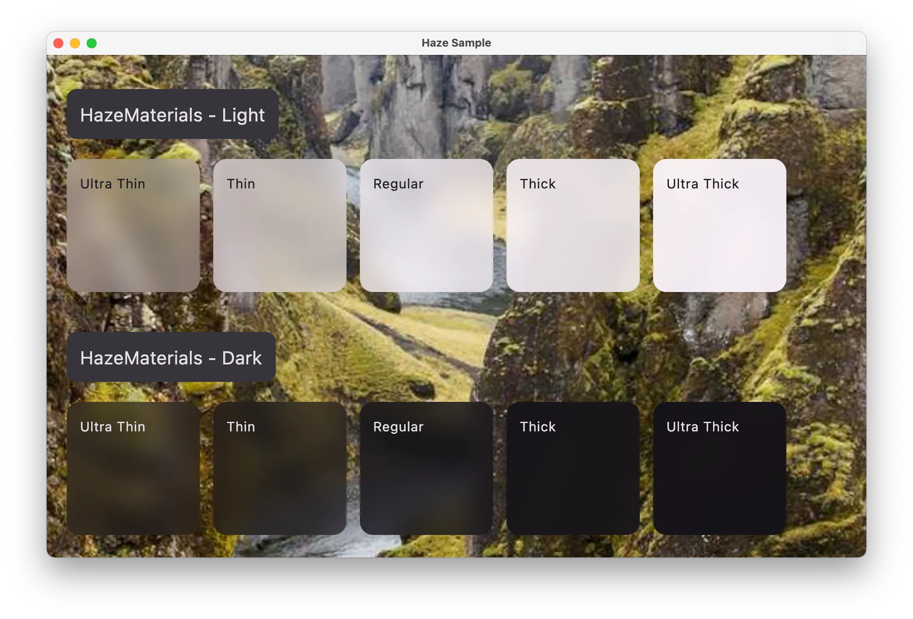

# Blur Materials

Pre-built blur style implementations that match common design systems.

## Download

[](https://search.maven.org/search?q=g:dev.chrisbanes.haze)

```kotlin
repositories {
    mavenCentral()
}

dependencies {
    implementation("dev.chrisbanes.haze:haze-materials:<version>")
}
```

## HazeMaterials

Implementations of Material Design blur styles, inspired by SwiftUI Material APIs. These don't attempt to replicate exact iOS effects, but rather provide pleasant blur styles compatible with Material Design.



Class reference: [HazeMaterials](../api/haze-materials/dev.chrisbanes.haze.blur.materials/-haze-materials/index.html).

### Usage

```kotlin
Box {
  LazyColumn(
    modifier = Modifier.hazeSource(state = hazeState)
  ) {
    // content
  }

  TopAppBar(
    modifier = Modifier.hazeEffect(state = hazeState) {
      blurEffect {
        style = HazeMaterials.thin()
      }
    }
  )
}
```

Available levels: `thin()`, `regular()`, `thick()`, and more.

## CupertinoMaterials

Blur styles matching Apple platforms (iOS, macOS). Values are taken from the [iOS 18 Figma](https://www.figma.com/community/file/1385659531316001292) file published by Apple.

Use these for consistency when mixing Compose Multiplatform with SwiftUI.


Class reference: [CupertinoMaterials](../api/haze-materials/dev.chrisbanes.haze.blur.materials/-cupertino-materials/index.html).

### Usage

```kotlin
blurEffect {
  style = CupertinoMaterials.thin()
}
```

## FluentMaterials

Blur styles matching Windows platforms (WinUI 3). Values are taken from the WinUI 3 Figma file published by Microsoft.

Use these for consistency when mixing Compose Multiplatform with WinUI.


Class reference: [FluentMaterials](../api/haze-materials/dev.chrisbanes.haze.blur.materials/-fluent-materials/index.html).

### Usage

```kotlin
blurEffect {
  style = FluentMaterials.thin()
}
```

## Custom Styles

To create custom blur styles, use the [HazeStyle](../api/haze-blur/dev.chrisbanes.haze.blur/-haze-style/index.html) data class:

```kotlin
val customStyle = HazeStyle(
  blurRadius = 15.dp,
  tints = listOf(Color.Black.copy(alpha = 0.2f)),
  noise = 0.1f
)

blurEffect {
  style = customStyle
}
```

Or set properties directly in the `blurEffect` block:

```kotlin
blurEffect {
  blurRadius = 15.dp
  tints = listOf(Color.Black.copy(alpha = 0.2f))
  noise = 0.1f
}
```
