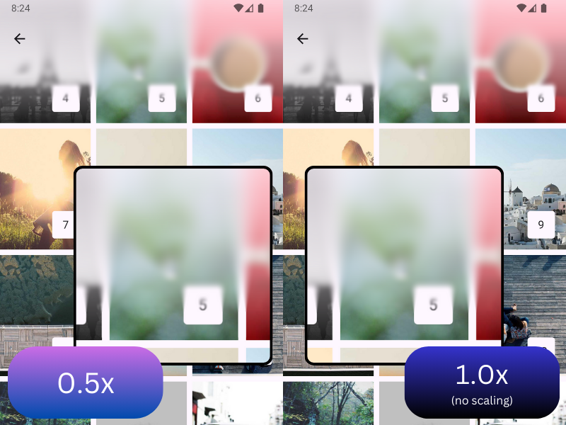

# Blur Usage

This guide covers the blur effect in detail, including all available features and patterns.

## Modes

Blur works in two modes: 'background blurring' and 'foreground blurring'. Both modes use the same APIs and features, with the main difference being whether you need a `HazeState`.

### Background Blurring (Most Common)

Blurs content from elsewhere in the UI that's marked with `hazeSource`:

```kotlin
val hazeState = rememberHazeState()

Box {
  LazyColumn(
    modifier = Modifier
      .fillMaxSize()
      .hazeSource(state = hazeState)
  ) {
    // scrollable content
  }

  TopAppBar(
    modifier = Modifier
      .hazeEffect(state = hazeState) {
        blurEffect {
          style = HazeMaterials.thin()
        }
      }
      .fillMaxWidth(),
  )
}
```

### Foreground Blurring

Blurs the content within the composable itself. No `HazeState` or `hazeSource` needed:

```kotlin
@Composable
fun HazeExample(modifier: Modifier = Modifier) {
  Box(modifier = modifier) {
    Foreground(
      modifier = Modifier
        .hazeEffect {
          blurEffect {
            style = HazeMaterials.thin()
          }
        }
        .fillMaxSize()
    )
  }
}
```

## Styling

Blur appearance is controlled via the [HazeStyle](../api/haze-blur/dev.chrisbanes.haze.blur/-haze-style/index.html) class or properties in the `blurEffect` block:

Styles can be provided in multiple ways:

- [LocalHazeStyle](../api/haze-blur/dev.chrisbanes.haze.blur/-local-haze-style.html) composition local
- `style` property inside `blurEffect {}` block
- Individual properties in the `blurEffect {}` block

### HazeEffectScope Lambda

The `blurEffect` block receives properties you can set dynamically:

```kotlin
TopAppBar(
  modifier = Modifier
    .hazeEffect(state = hazeState) {
      blurEffect {
        alpha = if (listState.firstVisibleItemIndex == 0) {
          listState.layoutInfo.visibleItemsInfo.first().let {
            (it.offset / it.size.height.toFloat()).absoluteValue
          }
        } else {
          1f
        }
      }
    },
)
```

### Styling Resolution

Each styling property is resolved using the following precedence:

1. Value set in `blurEffect {}` block (if specified)
2. Value set via `style` property in `blurEffect {}` (if specified)
3. Value set in [LocalHazeStyle](../api/haze-blur/dev.chrisbanes.haze.blur/-local-haze-style.html) composition local
4. Default value

### Styling Properties

#### Blur Radius

Controls how strong the blur effect is. Defaults to `20.dp`. Larger values may be needed to keep foreground control (text) legible.

```kotlin
blurEffect {
  blurRadius = 20.dp
}
```

#### Tint

A tint effect is applied primarily to maintain contrast and legibility. By default, the provided background color is used at 70% opacity. You can provide multiple tints applied in sequence:

```kotlin
blurEffect {
  tints = listOf(
    Color.Black.copy(alpha = 0.2f),
    Color.Blue.copy(alpha = 0.1f)
  )
}
```

#### Noise

Visual noise provides tactility. Defaults to `0.15f` (15% strength). Disable by setting to `0f`:

```kotlin
blurEffect {
  noise = 0f  // Disable noise
}
```

## Progressive (Gradient) Blurs

Progressive blurs vary the blur radius across a dimension. This effect is common on iOS:


Enable by setting the `progressive` property on [HazeEffectScope](../api/haze/dev.chrisbanes.haze/-haze-effect-scope/index.html):

```kotlin
TopAppBar(
  modifier = Modifier.hazeEffect(hazeState) {
    blurEffect {
      progressive = HazeProgressive.verticalGradient(
        startIntensity = 1f,
        endIntensity = 0f
      )
    }
  }
)
```

### Linear Gradient

Vertical, horizontal, or custom-angle gradients:

```kotlin
progressive = HazeProgressive.verticalGradient(
  startIntensity = 1f,
  endIntensity = 0f
)

// or horizontal
progressive = HazeProgressive.horizontalGradient(
  startIntensity = 1f,
  endIntensity = 0f
)
```

Class documentation: [HazeProgressive.LinearGradient](../api/haze-blur/dev.chrisbanes.haze.blur/-haze-progressive/-linear-gradient/index.html)

### Radial Gradient

A gradient radiating from a center point:

```kotlin
progressive = HazeProgressive.RadialGradient()
```

Class documentation: [HazeProgressive.RadialGradient](../api/haze-blur/dev.chrisbanes.haze.blur/-haze-progressive/-radial-gradient/index.html)

### Custom Brush

Use any [Brush](https://developer.android.com/develop/ui/compose/graphics/draw/brush) as an alpha mask:

```kotlin
progressive = HazeProgressive.Brush(
  brush = Brush.verticalGradient(...)
)
```

Class documentation: [HazeProgressive.Brush](../api/haze-blur/dev.chrisbanes.haze.blur/-haze-progressive/-brush/index.html)

!!! warning "Performance of Progressive Blur"

    Progressive blur comes with a performance cost. See the [Performance](../performance.md) page for benchmarks.

    Quick summary: Android 13+ costs ~25% more than non-progressive. On Android 12 it's about 2x. Consider using masking below for better performance.

## Masking

Apply any [Brush](https://developer.android.com/develop/ui/compose/graphics/draw/brush) as an opacity mask:

```kotlin
TopAppBar(
  modifier = Modifier.hazeEffect(state = hazeState) {
    blurEffect {
      mask = Brush.verticalGradient(
        colors = listOf(Color.Black, Color.Transparent)
      )
    }
  }
)
```

!!! info "Mask vs Progressive"

    Masks fade the effect through opacity only and may not feel as refined as progressive blur. However, masks are much faster with negligible performance cost.

## Input Scale

Optimize performance by rendering the effect at a lower resolution:



```kotlin
TopAppBar(
  modifier = Modifier.hazeEffect(state = hazeState) {
    inputScale = HazeInputScale.Auto
    blurEffect {
      // ...
    }
  }
)
```

[HazeInputScale](../api/haze/dev.chrisbanes.haze/-haze-input-scale/index.html) options:

- `HazeInputScale.None`: No scaling (default)
- `HazeInputScale.Auto`: Automatic scaling with platform defaults
- `HazeInputScale.Fixed(...)`: Custom scaling factor (0.0 to 1.0)

Values less than 1.0 improve performance at the cost of quality. Common values:
- `0.66` - ~55% pixel reduction, imperceptible to most users
- `0.5` - ~75% pixel reduction, noticeable but often acceptable
- `0.33` - ~89% pixel reduction, likely visually different

!!! info "Experimentation Recommended"

    Always benchmark with your specific styling parameters to find the right balance for your use case.

## Overlapping Blurred Layouts

A layout can use both `hazeEffect` (drawing blur from other areas) and `hazeSource` (serving as a blur source for others):


This enables overlapping blurred cards:

```kotlin
Box {
  val hazeState = rememberHazeState()

  Background(
    modifier = Modifier.hazeSource(hazeState, zIndex = 0f)
  )

  // Rear card
  CreditCard(
    modifier = Modifier
      .hazeSource(hazeState, zIndex = 1f)
      .hazeEffect(hazeState)
  )

  // Middle card
  CreditCard(
    modifier = Modifier
      .hazeSource(hazeState, zIndex = 2f)
      .hazeEffect(hazeState),
  )

  // Front card
  CreditCard(
    modifier = Modifier
      .hazeSource(hazeState, zIndex = 3f)
      .hazeEffect(hazeState)
  )
}
```

The `zIndex` parameter tells Haze which layers to draw. By default, a `hazeEffect` draws all layers with a `zIndex` less than its sibling `hazeSource`.

### Filtering Areas

Control which layers are included via the `canDrawArea` filter:

```kotlin
CreditCard(
  modifier = Modifier
    .hazeSource(hazeState, zIndex = 2f, key = "foo")
    .hazeEffect(hazeState) {
      canDrawArea = { area ->
        area.key != "foo"  // Exclude self
      }
    },
)
```

## Enabling Blur

Control whether blurring is active on individual effects:

```kotlin
blurEffect {
  blurEnabled = true  // or false to disable
}
```

## Dialogs

You can blur dialog backgrounds over content. **Important**: Tints display as a scrim over background with dialogs, so use a translucent dialog background color instead:

```kotlin
val hazeState = rememberHazeState()
var showDialog by remember { mutableStateOf(false) }

Box {
  if (showDialog) {
    Dialog(onDismissRequest = { showDialog = false }) {
      Surface(
        modifier = Modifier
          .fillMaxWidth()
          .fillMaxHeight(fraction = .5f),
        shape = MaterialTheme.shapes.extraLarge,
        // Set translucent background instead of using tints
        color = MaterialTheme.colorScheme.surface.copy(alpha = 0.2f),
      ) {
        Box(
          Modifier.hazeEffect(state = hazeState) {
            blurEffect {
              style = HazeMaterials.regular()
            }
          },
        ) {
          // Dialog content
        }
      }
    }
  }

  LazyVerticalGrid(
    modifier = Modifier.hazeSource(state = hazeState),
  ) {
    // Background content
  }
}
```

Complete sample: [DialogSample](https://github.com/chrisbanes/haze/blob/main/sample/shared/src/commonMain/kotlin/dev/chrisbanes/haze/sample/DialogSample.kt)
