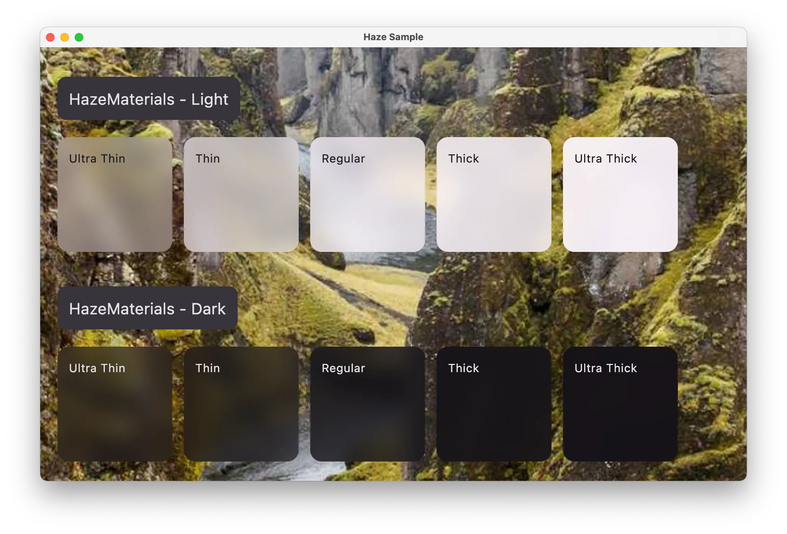
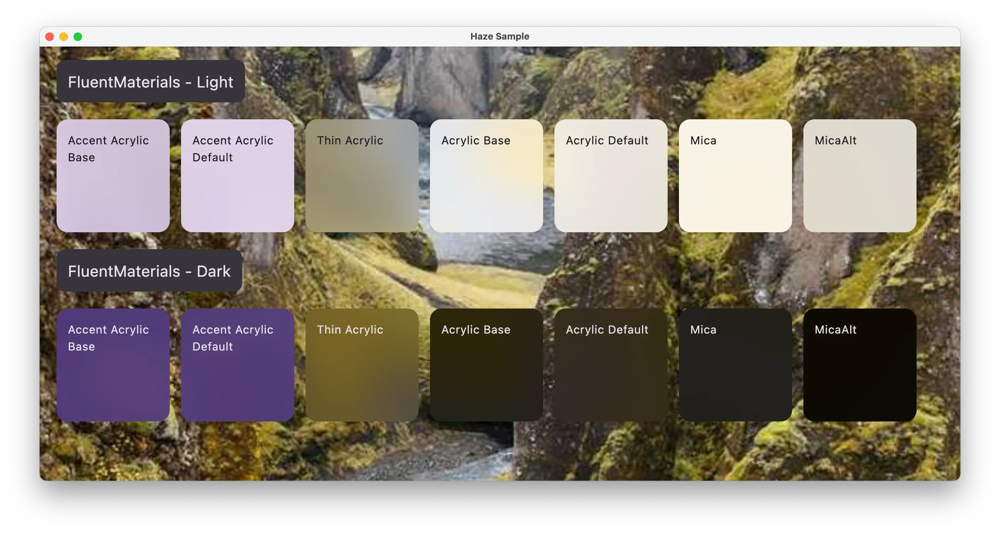

We provide off of the shelf implementations of [HazeStyle](../api/haze/dev.chrisbanes.haze/-haze-style/)s which implement 'materials' of various styles.

## Download

[](https://search.maven.org/search?q=g:dev.chrisbanes.haze)

``` kotlin
repositories {
    mavenCentral()
}

dependencies {
    implementation("dev.chrisbanes.haze:haze-materials:<version>")
}
```

### HazeMaterials

A class which contains functions to build HazeStyles which implement 'material-like' styles. It is inspired by the material APIs available in SwiftUI, but it makes no attempt to provide the exact effects provided in iOS (unlike [CuperintoMaterials](#cupertinomaterials) below).



Class reference: [HazeMaterials](../api/haze-materials/dev.chrisbanes.haze.materials/-haze-materials/).

### CupertinoMaterials

A class which contains functions to build HazeStyles which implement 'material' styles similar to those available on Apple platforms. The values used are taken from the [iOS 18 Figma](https://www.figma.com/community/file/1385659531316001292) file published by Apple.

The primary use case for using these is for when aiming for consistency with native UI (i.e. for when mixing Compose Multiplatform content alongside SwiftUI content).


Class reference: [CupertinoMaterials](../api/haze-materials/dev.chrisbanes.haze.materials/-cupertino-materials/).

### FluentMaterials

These implement 'material' styles similar to those available on Windows platforms. The values used are taken from the WinUI 3 Figma file published by Microsoft. 

The primary use case for using these is for when aiming for consistency with native UI (i.e. for when mixing Compose Multiplatform content alongside WinUI content).



Class reference: [FluentMaterials](../api/haze-materials/dev.chrisbanes.haze.materials/-fluent-materials/).

## Usage

All of these are provided through functions on the relevant materials class, with each function providing a different level of material.

``` kotlin hl_lines="8"
Box {
  // rest of sample from above

  LargeTopAppBar(
    modifier = Modifier
      .hazeChild(
        ...
        style = HazeMaterials.thin(),
      ),
  )
}
```