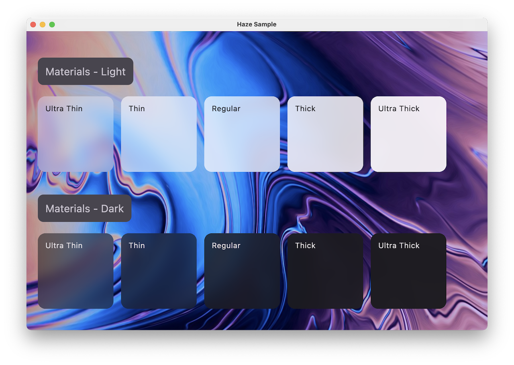

We provide off of the shelf implementations of [HazeStyle](../api/haze/dev.chrisbanes.haze/-haze-style/)s which implement 'materials' of varying opacity.



!!! info
    It is inspired by the [materials](https://developer.apple.com/design/human-interface-guidelines/materials) available on Apple platforms, but it makes no attempt to provide the exact effects provided in iOS or other operating systems.

## Usage

Everything is provided through functions on the [HazeMaterials](../api/haze-materials/dev.chrisbanes.haze.materials/-haze-materials/) class, with each function providing a different material.

``` kotlin hl_lines="8"
Box {
  // rest of sample from above

  LargeTopAppBar(
    modifier = Modifier
      .hazeChild(
        ...
        style = HazeMaterials.thin(),
      ),
  )
}
```

## Download

[](https://search.maven.org/search?q=g:dev.chrisbanes.haze)

``` kotlin
repositories {
    mavenCentral()
}

dependencies {
    implementation("dev.chrisbanes.haze:haze-materials:<version>")
}
```
