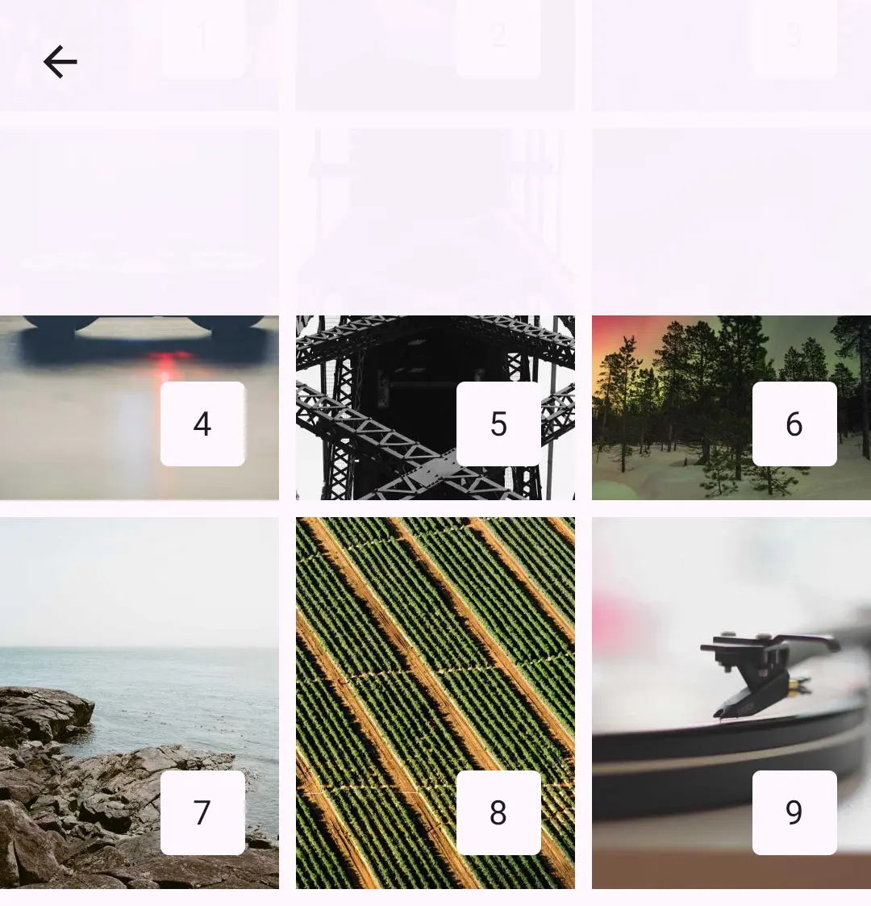

Haze works on all platforms which [Compose Multiplatform](https://www.jetbrains.com/compose-multiplatform/) supports. 


!!! note "Compose Multiplatform platforms"

    Please note, the list of platforms which Compose Multiplatform (CMP) supports is different to the platforms which Kotlin Multiplatform supports. Please stop raising issues about adding "MacOS" support; it is not supported (directly) by CMP.

## Android

### Android 14+

SDK Levels: 33+

Haze is in its optimal environment for all use cases when running on recent versions of Android.

### Android 12 & 13

SDK Levels: 31 & 32

When running on these versions of Android, Haze needs to use a few workarounds:

#### HazeProgressive

Only linear gradient [HazeProgressive](api/haze/dev.chrisbanes.haze/-haze-progressive/index.html) effects are supported, and are implemented via a mechanism which draws the effect multiple times. This can hurt performance, so it is recommended to verify the performance of this yourself. 

You can disable this behavior by setting the [preferPerformance](api/haze/dev.chrisbanes.haze/-haze-progressive/-companion/index.html) property. When set to true, the progressive 'effect' will instead be drawn via a mask:

```kotlin hl_lines="6"
LargeTopAppBar(
  // ...
  modifier = Modifier.hazeEffect(hazeState) {
    progressive = HazeProgressive.verticalGradient(
      // ...
      preferPerformance = true,
    )
  }
)
```

All other progressive types will fallback to using a mask when running on Android 12 & 13.

### Android 12 and below

When running on Android 12 and below, we can not rely on [RenderNode][rendernode] (which [GraphicsLayer][graphicslayer] use internally) re-painting when content changes. For this reason, Haze _previously_ disabled blurring effects on Android 12 by default, as we could not guarantee that it works. 

As of Haze v1.6 and newer though, we have a mechanism allowing Haze to re-enable blurring on Android 12 by default. 

This same mechanism is required to enable blurring to work on Android 11 and below too, when enabled (more on that below).

??? info "Manual invalidation mechanism"

    The mechanism involves Haze manually invalidating the graphics layers manually when necessary, using 'pre draw' events. This document is not the place to go deep into 'pre draw' events, but the main point here is that Compose does not send a pre-draw event itself, so Haze needs to use the host view system's listener (via [ViewTreeObserver](https://developer.android.com/reference/android/view/ViewTreeObserver)). This means that we are not subscribing to when our particular draw nodes are about to draw, but instead we are called whenever _anything_ is about to be drawn on screen. 
    
    The TL;DR of this section is that the event we listen to is a lot more global than we need. Ideally we would have a way to know when the `hazeSource` node is about to be drawn (and only when the node is about to be drawn) but that functionality does not exist.

    The downside to this mechanism is that it will trigger more invalidations than what is really needed. We're effectively negating some of the granular invalidations which Compose enables through it's [phasing system](https://developer.android.com/develop/ui/compose/phases). It should not cause your apps any performance issues, but you can disable blurring if necessary. See [docs here](usage.md#enabling-blur) for more information.

### Android 11 and below

SDK Levels: 30 and below

On Android 11 and below, blurring by default is disabled. When disabled, a scrim (translucent overlay) implementation is used which looks like so:



#### RenderScript blurring

🆕 in Haze 1.6 is an implementation of blurring which uses [RenderScript](https://developer.android.com/guide/topics/renderscript/compute).

!!! warning "Experimental"

    Blurring on Android 11 and below is not enabled by default, and is considered experimental.

    We may enable it by default in the future, or we may just remove it all together if it is deemed too unstable. Lots of testing and feedback is required, so please raise issues if you find any problems.

Using RenderScript does come with some drawbacks compared to [RenderEffect][rendereffect] which we use on Android 12+. The biggest is that RenderScript and your drawn content are two distinct things, which means that for Haze to blur your composable content, we need to draw it somewhere which RenderScript can read, and then also write to. This results in copying of data, which makes this blurring implementation quite slow.

As this implementation is slow, it means that processing a frame can easily take longer than our allocated frame budget time. To combat this, Haze uses a background thread to process and blur frames, but this comes with the drawback that content updates will nearly always be a frame (or more) behind. In addition to this, Haze will only ever process one frame at a time. If a new draw is called and Haze is still processing a previous frame, Haze will simply ignore it. This is to ensure that Haze does not unintentionally create a queue of frames, and potentially overwhelm the device.

To the user the blur effect may look 'laggy' or slow to update, especially when the background content changes a lot. This is the compromise which we have decided to make in Haze, but in my opinion it is more than good enough for the majority of use cases.

{: style='width: 50%'}

As mentioned above, blurring on Android 11 and below is not enabled by default. See the [docs here](usage.md#enabling-blur) on how to enable it. 

One final thing to note is that Haze needs to use the "Manual invalidation mechanism" mentioned above for this to work.

!!! info "Thanks"

    Big thanks to [Serhii Yaremych](https://github.com/desugar-64) for his help on this, as we have managed to get an optimized 'content write' working. 🚀

## Desktop

Desktop JVM is a Compose Multiplatform target which is built upon [Skiko][skiko], so see the [Skiko](#skiko) docs below.

## iOS

iOS is a Compose Multiplatform target which is built upon [Skiko][skiko], so see the [Skiko](#skiko) docs below.

## Web

Compose for Web is based on Kotlin/Wasm, and is a Compose Multiplatform target which is built upon [Skiko][skiko], so see the [Skiko](#skiko) docs below.

## Skiko

Most of the Compose Multiplatform targets are built on top of [Skiko][skiko], which is a bundled version of the [Skia Graphics Library](https://skia.org) with Kotlin bindings.

As Skiko bundles Skia into the app binaries, this means that the host platform we're running on is not particularly important to Haze. All of that is hopefully handled by the platform integration layers in CMP, Skiko and Skia.

The most important thing when running on these platforms is the library versions we're built against. Haze is always built, tested and released against the latest stable version of Compose Multiplatform.

Other than that, running on a Skiko-backed platform means that Haze is running in its optimal environment.

### Using pre-release versions of Compose Multiplatform

 We do occassionaly verify against pre-release versions of CMP, but it's not something we guarantee. If you want to use a pre-release version of Compose Multiplatform, then please test it thoroughly.


 [rendernode]: https://developer.android.com/reference/android/graphics/RenderNode
 [rendereffect]: https://developer.android.com/reference/android/graphics/RenderEffect
 [graphicslayer]: https://developer.android.com/reference/kotlin/androidx/compose/ui/graphics/layer/GraphicsLayer
 [skiko]: https://github.com/JetBrains/skiko