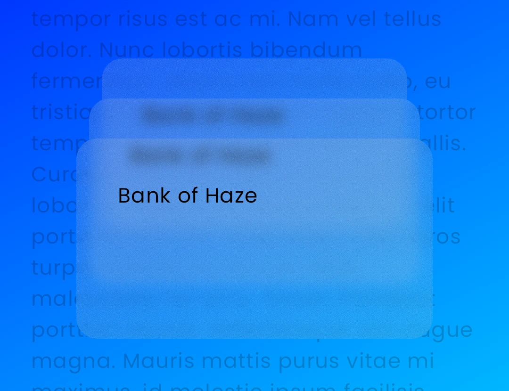

Haze works has two modes: 'background blurring', and 'foreground blurring', and the way you use them is extremely similar. Most of this page will assume that you wish to use 'background blurring', as it's the most common, but there is a section at the bottom of this page to outline how to perform 'foreground blurring'.

Haze is implemented through two Compose Modifiers: [Modifier.hazeSource](api/haze/dev.chrisbanes.haze/haze-source.html) and [Modifier.hazeEffect](api/haze/dev.chrisbanes.haze/haze-effect.html).

The most basic usage would be something like:

``` kotlin hl_lines="1 7-8 17-19"
val hazeState = rememberHazeState()

Box {
  LazyColumn(
    modifier = Modifier
      .fillMaxSize()
      // Pass it the HazeState we stored above
      .hazeSource(state = hazeState)
  ) {
    // todo
  }

  val hazeStyle = HazeMaterials.ultraThin()

  LargeTopAppBar(
    // Need to make app bar transparent to see the content behind
    colors = TopAppBarDefaults.largeTopAppBarColors(Color.Transparent),
    modifier = Modifier
      // We use hazeEffect on anything where we want the background
      // blurred.
      .hazeEffect(state = hazeState) {
        blurEffect {
          style = hazeStyle
        }
      }
      .fillMaxWidth(),
  )
}
```

You will notice that were using a style created by `HazeMaterials.ultraThin()`. The [HazeMaterials](materials.md) are sets of prebuilt styles that are available as an add-on library.

If you do not provide an explicit style, the default values will provide basic blurring, but no tinting. It's recommended to use one of the materials linked above, or a custom style which meets your requirements.

## Styling

Haze has support for customizing the resulting effect, which is performed via the [HazeStyle](api/haze-blur/dev.chrisbanes.haze.blur/-haze-style/index.html) class, or the lambda block provided to `hazeEffect`.

In Haze v2, blur functionality is implemented through the [BlurVisualEffect](api/haze-blur/dev.chrisbanes.haze.blur/-blur-visual-effect/index.html) class, which is configured using the `blurEffect {}` extension function within the `hazeEffect` block.

Styles can be provided in a number of different ways:

- [LocalHazeStyle](api/haze-blur/dev.chrisbanes.haze.blur/-local-haze-style.html) composition local.
- By setting the `style` property inside the `blurEffect {}` block within [Modifier.hazeEffect](api/haze/dev.chrisbanes.haze/haze-effect.html).
- By setting the relevant property in the optional [HazeEffectScope](api/haze/dev.chrisbanes.haze/-haze-effect-scope/index.html) lambda `block`, passed into [Modifier.hazeEffect](api/haze/dev.chrisbanes.haze/haze-effect.html).

### HazeEffectScope

We now have a parameter on `Modifier.hazeEffect` which allow you to provide a lambda block, for controlling all of Haze's styling parameters. It is similar to concept to `Modifier.graphicsLayer { ... }`.

It's useful for when you need to update styling parameters, using values derived from other state. Here's an example which fades the effect as the user scrolls:

```kotlin
FooAppBar(
  ...
  modifier = Modifier
    .hazeEffect(state = hazeState) {
      blurEffect {
        alpha = if (listState.firstVisibleItemIndex == 0) {
          listState.layoutInfo.visibleItemsInfo.first().let {
            (it.offset / it.size.height.toFloat()).absoluteValue
          }
        } else {
          alpha = 1f
        }
      }
    },
)
```

### Styling resolution

As we a few different ways to set styling properties, it's important to know how the final values are resolved.

Each styling property (such as `blurRadius`) is resolved seperately, and the order of precedence for each property is as follows, in order:

- Value set in [BlurVisualEffect](api/haze-blur/dev.chrisbanes.haze.blur/-blur-visual-effect/index.html) via the `blurEffect {}` block, if specified.
- Value set in the `style` property within `blurEffect {}` (or [BlurVisualEffect.style](api/haze-blur/dev.chrisbanes.haze.blur/-blur-visual-effect/style.html)), if specified.
- Value set in the [LocalHazeStyle](api/haze-blur/dev.chrisbanes.haze.blur/-local-haze-style.html) composition local.

### Styling properties

#### Blur Radius

The blur radius controls how strong the blur effect is. This defaults to `20.dp` but can be customized as needed. Larger values might be needed to keep foreground control (such as text) legible and accessible.

#### Tint

A tint effect is applied, primarily to maintain contrast and legibility. By default we use the provided background color at 70% opacity. You may wish to use a different color or opacity. You provide multiple tints, which will be applied in sequence.

#### Noise

Some visual noise is applied, to provide some tactility. This is completely optional, and defaults to a value of `0.15f` (15% strength). You can disable this by providing `0f`.

## Progressive (aka gradient) blurs

Progressive blurs allow you to provide a visual effect where the blur radius is varied over a dimension. You may have seen this effect used on iOS.


Progressive blurs can be enabled by setting the `progressive` property on [HazeEffectScope](api/haze/dev.chrisbanes.haze/-haze-effect-scope/index.html). The API is very similar to the Brush gradient APIs, so it should feel familiar.

```kotlin
LargeTopAppBar(
  // ...
  modifier = Modifier.hazeEffect(hazeState) {
    blurEffect {
      progressive = HazeProgressive.verticalGradient(startIntensity = 1f, endIntensity = 0f)
    }
  }
)
```

There are a number of different types of progressive effect supported in Haze:

### Linear Gradient

Class documentation: [HazeProgressive.LinearGradient](api/haze-blur/dev.chrisbanes.haze.blur/-haze-progressive/-linear-gradient/index.html)

Linear gradients, usually vertical or horizontal, but you can set any angle.

There are a few builder functions on `HazeProgressive`, enabling common use cases: [verticalGradient](api/haze-blur/dev.chrisbanes.haze.blur/-haze-progressive/-companion/vertical-gradient.html) and [horizontalGradient](api/haze-blur/dev.chrisbanes.haze.blur/-haze-progressive/-companion/horizontal-gradient.html).

```kotlin
LargeTopAppBar(
  // ...
  modifier = Modifier.hazeEffect(hazeState) {
    blurEffect {
      progressive = HazeProgressive.verticalGradient(startIntensity = 1f, endIntensity = 0f)
    }
  }
)
```

### Radial Gradient

Class documentation: [HazeProgressive.RadialGradient](api/haze-blur/dev.chrisbanes.haze.blur/-haze-progressive/-radial-gradient/index.html)

A radial gradient, with a defined center and radius.

```kotlin
LargeTopAppBar(
  // ...
  modifier = Modifier.hazeEffect(hazeState) {
    blurEffect {
      progressive = HazeProgressive.RadialGradient()
    }
  }
)
```

### Custom Brush

Class documentation: [HazeProgressive.Brush](api/haze-blur/dev.chrisbanes.haze.blur/-haze-progressive/-brush/index.html)

A custom progressive effect, using a given [Brush](https://developer.android.com/develop/ui/compose/graphics/draw/brush) as the alpha mask for the entire effect.

Commonly this will be used to create along with a custom Shader, so we have a builder function to make this easier: [forShader](api/haze-blur/dev.chrisbanes.haze.blur/-haze-progressive/-companion/for-shader.html)

```kotlin
LargeTopAppBar(
  // ...
  modifier = Modifier.hazeEffect(hazeState) {
    blurEffect {
      progressive = HazeProgressive.forShader { size ->
        // TODO: return platform-specific Shader using the given size
      }
    }
  }
)
```

The Shader class is not commonized in Compose Multiplatform (it's an alias to the platform specific class), therefore you will likely need to use `expect` and `actual` functions to build the relevant shader.

!!! warning "Performance of Progressive"

    Please be aware that using progressive blurring does come with a performance cost. Please see the [Performance](performance.md) page for up-to-date benchmarks.

    As a quick summary: on Android SDK 33+ and other platforms, the cost is about 25% more than non-progressive. On Android SDK 32 it is about 2x. If performance is critical, you may wish to look at the masking functionality below.

## Masking

You can provide any [Brush](https://developer.android.com/develop/ui/compose/graphics/draw/brush), which will be used as a mask when the final effect is drawn.

```kotlin
LargeTopAppBar(
  // ...
  modifier = Modifier.hazeEffect(hazeState) {
    blurEffect {
      mask = Brush.verticalGradient(...)
    }
  }
)
```

!!! info "Mask vs Progressive"

    When you provide a gradient brush as a mask, the effect is visually similar to a gradient blur. The difference is that the effect is faded through opacity only, and may not feel as refined. However, it is much faster than progressive blurring, having a negligible cost.

## Input Scale

You can provide an input scale value which determines how much the content is scaled in both the x and y dimensions, allowing the blur effect to be potentially applied over scaled-down content (and thus less pixels), before being scaled back up and drawn at the original size.


```kotlin
LargeTopAppBar(
  // ...
  modifier = Modifier.hazeEffect(hazeState) {
    inputScale = HazeInputScale.Auto
  }
)
```

[HazeInputScale](api/haze/dev.chrisbanes.haze/-haze-input-scale/index.html) has a number of different options:

- `HazeInputScale.None`: Turns off input scaling (default)
- `HazeInputScale.Auto`: Turns on input scaling, with automatic values derived underneath.
- `HazeInputScale.Fixed(...)`: Turns on input scaling, using the value you pass in.

When using a `Fixed` value, less than 1.0 **may** improve performance, at the sacrifice of quality and crispness. As always, run your own benchmarks as to whether this compromise is worth it.

If you're looking for a good value to experiment with, `0.66` results in a reduction in total resolution of ~55%, while being visually imperceptible to most people (probably).

The minimum value I would realistically use is somewhere in the region of `0.33`, which results in the total pixel count of only 11% of the original content. This is likely to be visually different to no scaling, but depending on the styling parameters, it will be visually pleasing to the user.

## Overlapping blurred layouts

A layout node can use both a `Modifier.hazeEffect`, drawing a blurred effect from other areas, _and_ use `Modifier.hazeSource` to draw itself for other `hazeEffect` users.

This nested functionality sounds complicated, but in reality it enables a simple use case: overlapping blurred layout nodes.



This code to implement this is like below. You can see that the `CreditCard()` nodes use both the `hazeSource` and `hazeEffect` modifiers. **Pay attention to the modifier order here.**

``` kotlin
Box {
  val hazeState = rememberHazeState()

  Background(
    modifier = Modifier
      .hazeSource(hazeState, zIndex = 0f)
  )

  // Rear card
  CreditCard(
    modifier = Modifier
      .hazeSource(hazeState, zIndex = 1f)
      .hazeEffect(hazeState)
  )

  // Middle card
  CreditCard(
    modifier = Modifier
      .hazeSource(hazeState, zIndex = 2f)
      .hazeEffect(hazeState),
  )

  // Front card
  CreditCard(
    modifier = Modifier
      .hazeSource(hazeState, zIndex = 3f)
      .hazeEffect(hazeState)
  )
}
```

You will notice that there's something different here, the `zIndex` parameter.

For this to work you need to pass in the `zIndex` parameter of the node. It doesn't matter if you use `Modifier.zIndex`, or the implicit ordering from the layout, you need to explicitly pass in a valid `zIndex` value.

### zIndex

Internally, the zIndex value is how Haze knows which layers to draw in which nodes. By default, `hazeEffect` will draw all layers with a `zIndex` less than the value of the sibling `Modifier.hazeSource`. So in the example above, the middle card (`zIndex` of 2) will draw the rear card (`zIndex` of 1) and background (`zIndex` of 0).

This default behavior is usually the correct behavior for all use cases, but you can modify this behavior via the `canDrawArea` parameter, which acts as a filter when set:

``` kotlin
CreditCard(
  modifier = Modifier
    .hazeSource(hazeState, zIndex = 2f, key = "foo")
    .hazeEffect(hazeState) {
      canDrawArea = { area ->
        // return true to draw
        area.key != "foo"
      }
    },
)
```

You'll notice that we're using another parameter here, `key`. This just acts as an ID for the node allowing easier filtering. It has serves no other purpose.

## Deep UI hierarchies

You can pass `HazeState` objects to composables as arguments. For example:

```kotlin hl_lines="3 7 11"
@Composable
fun HazeExample(modifier: Modifier = Modifier) {
    val hazeState = rememberHazeState()

    Box(modifier = modifier) {
        Background(
          hazeState = hazeState,
          modifier = Modifier.fillMaxSize()
        )
        Foreground(
          hazeState = hazeState,
          modifier = Modifier.fillMaxSize()
        )
    }
}
```

You can then use the argument to configure `hazeSource` and `hazeEffect`:

```kotlin hl_lines="4 13-16"
@OptIn(ExperimentalHazeMaterialsApi::class)
@Composable
fun Foreground(
  hazeState: HazeState,
  modifier: Modifier = Modifier
) {
    Box(modifier = modifier) {
        val hazeStyle = HazeMaterials.ultraThin()
        Text(
            text = stringResource(R.string.haze_text),
            modifier = modifier
                .align(Alignment.Center)
                .wrapContentSize()
                .hazeEffect(state = hazeState) {
                    blurEffect {
                        style = hazeStyle
                    }
                }
        )
    }
}
```

However, this can problematic in deep hierarchies when you need to pass the `HazeState` instances
down through many levels. To avoid this you can use a composition local to pass the `HazeState`
down to the descendants in the hierarchy:

```kotlin hl_lines="1 5 7 12 25"
val LocalHazeState = compositionLocalOf { HazeState() }

@Composable
fun HazeExample(modifier: Modifier = Modifier) {
    val hazeState = rememberHazeState()

    CompositionLocalProvider(LocalHazeState provides hazeState) {
        Box(modifier = modifier) {
            Background(modifier = Modifier.fillMaxSize())
            Foreground(modifier = Modifier.fillMaxSize())
        }
    }
}

@OptIn(ExperimentalHazeMaterialsApi::class)
@Composable
fun Foreground(modifier: Modifier = Modifier) {
  Box(modifier = modifier) {
    val hazeStyle = HazeMaterials.ultraThin()
    Text(
      text = stringResource(R.string.haze_text),
      modifier = modifier
        .align(Alignment.Center)
        .wrapContentSize()
        .hazeEffect(state = LocalHazeState.current) {
          blurEffect {
            style = hazeStyle
          }
        }
    )
  }
}
```

## Dialogs

You can use Haze with `Dialog`s, to blur dialog backgrounds over content.

!!! warning "Tints with Dialogs"

    When using Haze with dialogs, you cannot use the `tints` property within `blurEffect {}`, as the tint will display a scrim over the background content instead of being applied to the dialog itself. Instead, you need to set a translucent background color on the dialog content.

Here's a complete example:

```kotlin
val hazeState = rememberHazeState()
var showDialog by remember { mutableStateOf(false) }

if (showDialog) {
  Dialog(onDismissRequest = { showDialog = false }) {
    Surface(
      modifier = Modifier
        .fillMaxWidth()
        .fillMaxHeight(fraction = .5f),
      shape = MaterialTheme.shapes.extraLarge,
      // Set a translucent background instead of using tints
      color = MaterialTheme.colorScheme.surface.copy(alpha = 0.2f),
      contentColor = MaterialTheme.colorScheme.onSurface,
    ) {
      Box(
        Modifier.hazeEffect(state = hazeState) {
          blurEffect {
            style = HazeMaterials.regular()
          }
        },
      ) {
        // Dialog content
      }
    }
  }
}

// Background content with hazeSource
LazyVerticalGrid(
  modifier = Modifier.hazeSource(state = hazeState),
  // ...
) {
  // ...
}
```

A complete sample is available: [DialogSample](https://github.com/chrisbanes/haze/blob/main/sample/shared/src/commonMain/kotlin/dev/chrisbanes/haze/sample/DialogSample.kt).

## Enabling blur

Whether blurring is enabled or not can be controlled on each individual `hazeEffect` like so:

```kotlin
Modifier.hazeEffect(...) {
    blurEffect {
        blurEnabled = true
    }
}
```

### Foreground blurring

As mentioned above, Haze also supports foreground blurring, where the content on the layout itself will be blurred by Haze and then drawn. You might be wondering why this is at the bottom of this page? Well nearly everything listed above is also applicable for 'foreground blurring'.

The only difference with foreground blurring is that you do not need to use a `HazeState` or `Modifier.hazeSource`, you only need a `Modifier.hazeEffect`.

To perform foreground blurring on a layout, you can do the following:

```kotlin
@Composable
fun HazeExample(modifier: Modifier = Modifier) {
  Box(modifier = modifier) {
    Foreground(
      modifier = Modifier
        // Note that we do NOT pass in a HazeState
        .hazeEffect {
          blurEffect {
            // Use all of the same features as above
            tints = // ...
            progressive = // ...
          }
        }
        .fillMaxSize()
    )
  }
}
```

## Screenshot testing

Haze support screenshot testing. It is itself heavily screenshot tested, using Roborazzi on both JVM Desktop and Android (Robolectric).

When using Robolectric it is important to take note of what SDK Level you are running against. When running on Android, Haze uses the built-in [RenderEffect.createBlurEffect](https://developer.android.com/reference/android/graphics/RenderEffect#createBlurEffect(float,%20float,%20android.graphics.Shader.TileMode)) using the [CLAMP](https://developer.android.com/reference/android/graphics/Shader.TileMode#CLAMP) tile mode. This enables the blur effect to work correctly at the edges of the area. Support for the CLAMP tile mode was only added in Robolectric recently, and requires your tests to be running against SDK 35 (or above).

If your tests are running against an earlier SDK Level (say 33), you may find that the edges any blurred areas look strange and incorrect. This only affects your tests though. The fix is fairly simple: update your screenshot tests to use SDK Level 35+, like so: `@Config(sdk = [35])`.

Other host screenshot testing libraries may work, but they have not tested and I have no bandwidth to support them. YMMV.
